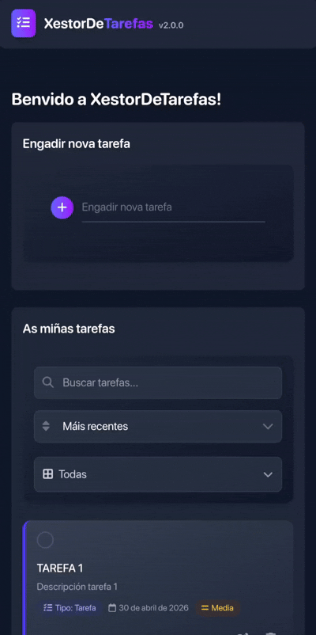

# XestorDeTarefas Android

Aplicación Android de xestión persoal de tarefas e proxectos feita con React + Redux Toolkit + Capacitor.

## Repositorios

- Android (este repo): [IPardelo/xestor-de-tarefas-app](https://github.com/IPardelo/xestor-de-tarefas-app)
- Web/escritorio: [IPardelo/xestor-de-tarefas-web](https://github.com/IPardelo/xestor-de-tarefas-web)



## Requisitos

- Node.js 18+ (recomendado 20+)
- npm
- Android Studio
- Android SDK
- Dispositivo Android ou emulador

## Configuración

1) Instalar dependencias:

```bash
npm install
```

2) Configurar Firebase:

- copia `.env.example` a `.env`
- completa as variables `VITE_FIREBASE_*`

## Arranque en Android

1) Compilar a app web e sincronizar con Android:

```bash
npm run android:sync
```

2) Abrir o proxecto nativo:

```bash
npm run android:open
```

3) En Android Studio:

- espera ao sync de Gradle
- selecciona dispositivo/emulador
- preme **Run**

## Scripts dispoñibles

- `npm run android:sync` - build web + sync Android.
- `npm run android:open` - abre Android Studio.
- `npm run android:run` - sync e execución directa.
- `npm run build` - build web de produción.
- `npm run lint` - lint do código.

## Tecnoloxías

- React 19
- Redux Toolkit
- Capacitor 8
- Firebase Firestore
- Vite 6

## Licenza

MIT. Ver `LICENSE`.